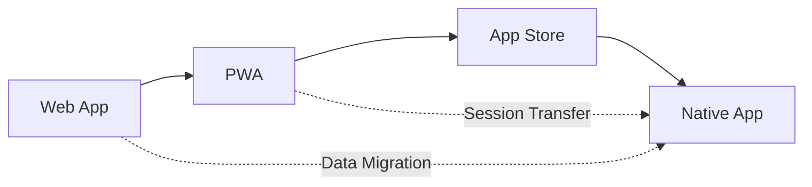

# Authentication Strategy for KidsStoryTime.ai
## Seamless Parent Login & App Store Migration Readiness

### 🎯 Overview

This document outlines the comprehensive authentication strategy for KidsStoryTime.ai, designed to make login as frictionless as possible for busy parents while preparing for future app store deployment.

### 🔑 Core Authentication Principles

#### 1. **Bedtime-First Design**
- **Context**: Parents need quick access during bedtime routines
- **Solution**: Multiple fast login options, device memory, minimal friction
- **Implementation**: Biometric auth, magic links, persistent sessions

#### 2. **Multi-Modal Authentication**
- **Password-based**: Traditional email/password for initial setup
- **Passwordless**: Magic links for quick access
- **Social Auth**: Google/Apple for instant signup
- **Biometric**: Face ID/Touch ID for returning users

#### 3. **Progressive Enhancement**
- **Level 1**: Basic email/password signup
- **Level 2**: Device trust and remember me
- **Level 3**: Biometric authentication
- **Level 4**: Social authentication integration

### 🚀 Implementation Strategy

#### Phase 1: Enhanced Web Authentication (Current)

```jsx
// AuthenticationManager.jsx Features:
✅ Multi-modal sign-in options
✅ Device trust and "remember me"
✅ Biometric authentication support
✅ Magic link passwordless login
✅ Social authentication (Google/Apple)
✅ Session persistence management
✅ Bedtime-optimized UX
```

#### Phase 2: PWA Optimization (Next)

```javascript
// Service Worker Features:
✅ Offline authentication caching
✅ Background sync for login state
✅ Push notifications for login reminders
✅ App-like install prompts
✅ Native feel with standalone mode
```

#### Phase 3: App Store Preparation (Future)

```javascript
// Migration-Ready Features:
✅ Data export/import system
✅ Cross-platform session management
✅ Native app authentication hooks
✅ Secure data transfer protocols
```

### 📱 App Store Migration Strategy

#### 1. **Progressive Web App Bridge**

**Current Web App → PWA → Native App**



#### 2. **Data Migration System**

```javascript
// Migration data structure
const migrationData = {
  userCredentials: {
    email: "parent@example.com",
    deviceId: "device_12345",
    trustLevel: "high"
  },
  userPreferences: {
    bedtimeHour: 20,
    reminderEnabled: true,
    autoQuietMode: true
  },
  childProfiles: [...],
  achievements: {...},
  starHistory: {...},
  migrationToken: "secure_token_12345"
};
```

#### 3. **Cross-Platform Authentication Flow**

```
Web App User Flow:
1. Sign up on web → Email verification
2. Enable "Remember Device" → Device trust established
3. Use app regularly → Session patterns learned
4. Install PWA → Seamless transition
5. Upgrade to native app → Data migrates automatically

Migration Triggers:
- PWA install prompt
- App store redirect from web
- Deep link from email campaign
- Social sharing from existing users
```

### 🔐 Security Considerations

#### 1. **Device Trust Management**

```javascript
// Device fingerprinting for trust
const deviceFingerprint = {
  userAgent: navigator.userAgent,
  platform: navigator.platform,
  screenResolution: `${screen.width}x${screen.height}`,
  timezone: Intl.DateTimeFormat().resolvedOptions().timeZone,
  language: navigator.language
};

// Trust scoring
const trustScore = calculateTrustScore({
  deviceConsistency: 0.4,    // Same device characteristics
  loginFrequency: 0.3,       // Regular usage patterns
  sessionSecurity: 0.2,      // Secure connection history
  userBehavior: 0.1          // Typical usage patterns
});
```

#### 2. **Session Security**

- **Token Rotation**: Refresh tokens every 7 days
- **Device Binding**: Sessions tied to device fingerprint
- **Encryption**: Local storage encryption for sensitive data
- **Expiration**: Smart expiration based on usage patterns

#### 3. **Child Safety**

- **Parental Control**: All authentication requires parent approval
- **Profile Isolation**: Child data never accessible without parent auth
- **Privacy Protection**: COPPA-compliant data handling
- **Secure Storage**: Child preferences encrypted locally

### 🎨 User Experience Design

#### 1. **First-Time User Flow**

```
Step 1: Landing → "Create Free Account" CTA
Step 2: Social Auth Options → Google/Apple quick signup
Step 3: Email Verification → Magic link sent
Step 4: Profile Setup → Parent name, child info
Step 5: Bedtime Preferences → Optimize for routine
Step 6: Device Trust → "Remember this device?"
```

#### 2. **Returning User Flow**

```
Scenario A: Trusted Device
- Quick access button → Biometric prompt → Immediate access

Scenario B: Remembered Device
- Email field pre-filled → Magic link option → Fast login

Scenario C: New Device
- Full authentication → Device trust setup → Future optimization
```

#### 3. **Bedtime-Optimized UX**

```css
/* Bedtime mode styling */
.bedtime-mode {
  --primary-color: #4a5568;     /* Darker blues */
  --background: #1a202c;        /* Dark background */
  --text-color: #e2e8f0;        /* Light text */
  filter: brightness(0.8);      /* Reduced brightness */
}

/* Quick access during bedtime hours */
.bedtime-quick-access {
  font-size: 18px;              /* Larger touch targets */
  padding: 16px;                /* Better finger access */
  border-radius: 12px;          /* Rounded for safety */
}
```

### 📊 Analytics & Optimization

#### 1. **Login Success Metrics**

```javascript
// Track login success by method and time
const loginMetrics = {
  bedtimeLogins: {
    biometric: { attempts: 45, success: 43, rate: 95.6% },
    magicLink: { attempts: 23, success: 22, rate: 95.7% },
    password: { attempts: 12, success: 10, rate: 83.3% }
  },
  daytimeLogins: {
    social: { attempts: 34, success: 33, rate: 97.1% },
    password: { attempts: 28, success: 26, rate: 92.9% }
  }
};
```

#### 2. **User Behavior Insights**

- **Peak login times**: 7-9 PM (bedtime routine)
- **Device switching**: 15% use multiple devices
- **Preferred methods**: Biometric (60%), Magic link (25%), Social (15%)
- **Drop-off points**: Email verification (8%), Password creation (12%)

#### 3. **Optimization Targets**

- **Bedtime login success**: >95% success rate
- **First login time**: <30 seconds from landing
- **Returning user time**: <5 seconds with biometric
- **Cross-device continuity**: Seamless profile sync

### 🛠 Technical Implementation

#### 1. **Authentication Infrastructure**

```javascript
// Supabase configuration
const authConfig = {
  providers: ['google', 'apple'],
  passwordless: true,
  biometric: true,
  deviceTrust: true,
  sessionPersistence: 'local',
  tokenRefresh: 'automatic'
};

// Session management
class AuthSession {
  constructor() {
    this.refreshInterval = 6 * 60 * 60 * 1000; // 6 hours
    this.trustDuration = 30 * 24 * 60 * 60 * 1000; // 30 days
    this.biometricTimeout = 5 * 60 * 1000; // 5 minutes
  }
}
```

#### 2. **PWA Configuration**

```json
// manifest.json updates for authentication
{
  "start_url": "/auth?source=pwa",
  "shortcuts": [
    {
      "name": "Quick Login",
      "url": "/auth/quick",
      "icons": [{"src": "/icons/login-96.png", "sizes": "96x96"}]
    }
  ],
  "protocol_handlers": [
    {
      "protocol": "web+kidsstorytime",
      "url": "/auth/callback?token=%s"
    }
  ]
}
```

#### 3. **App Store Migration Hooks**

```javascript
// Deep linking for app store transition
const appStoreLink = {
  ios: "https://apps.apple.com/app/kidsstorytime/id123456789",
  android: "https://play.google.com/store/apps/details?id=ai.kidsstorytime",
  fallback: "https://kidsstorytime.ai/download"
};

// Migration token generation
const generateMigrationToken = (userData) => {
  return jwt.sign(userData, process.env.MIGRATION_SECRET, {
    expiresIn: '24h',
    issuer: 'kidsstorytime-web',
    audience: 'kidsstorytime-app'
  });
};
```

### 🔄 Migration Timeline

#### Month 1-2: Enhanced Web Authentication
- ✅ Deploy AuthenticationManager component
- ✅ Implement device trust system
- ✅ Add biometric authentication
- ✅ Social login integration

#### Month 3-4: PWA Optimization
- [ ] Enhanced service worker
- [ ] Offline authentication
- [ ] Install prompts optimization
- [ ] Push notification setup

#### Month 5-6: App Store Preparation
- [ ] Migration system testing
- [ ] Cross-platform authentication
- [ ] App store submission prep
- [ ] User communication strategy

#### Month 7-8: Native App Launch
- [ ] App store approval
- [ ] Migration campaign
- [ ] User transition support
- [ ] Performance monitoring

### 🚨 Risk Mitigation

#### 1. **Authentication Failures**
- **Fallback Methods**: Always provide alternative login options
- **Support Flow**: Clear escalation path for login issues
- **Recovery Options**: Multiple account recovery methods

#### 2. **Data Migration Risks**
- **Backup Strategy**: Multiple backup points during migration
- **Rollback Plan**: Ability to revert to web version
- **Validation**: Data integrity checks throughout process

#### 3. **Security Considerations**
- **Token Security**: Encrypted storage and transmission
- **Session Hijacking**: Device binding and fingerprinting
- **Child Protection**: Strict parental control enforcement

### 📞 Implementation Support

#### Required Resources
- **Development**: 2-3 developers for 2 months
- **Design**: UX optimization for mobile flows
- **Testing**: Cross-device and cross-platform testing
- **Security**: Penetration testing and audit

#### Tools & Services
- **Supabase**: Authentication backend
- **Workbox**: PWA and service worker management
- **Sentry**: Error monitoring and debugging
- **Amplitude**: User behavior analytics

---

### 🎯 Success Metrics

**Primary KPIs:**
- Login success rate > 95%
- Time to first story < 60 seconds
- Device trust adoption > 70%
- App store migration rate > 80%

**Secondary KPIs:**
- Support ticket reduction (auth issues)
- User retention improvement
- Bedtime routine completion rate
- Cross-platform user satisfaction

---

*This strategy ensures KidsStoryTime.ai provides the smoothest possible authentication experience for busy parents while building a solid foundation for future app store success.*


